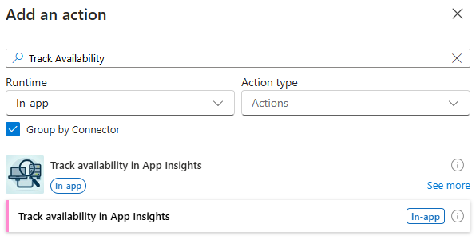

> [!IMPORTANT]  
> This NuGet package is still under development and is not yet available on nuget.org

---

# LogicApps.ServiceProviders.ApplicationInsights.TrackAvailability

This package contains a custom built-in connector for Standard Logic Apps. It contains an action that can send an availability test result to Azure Application Insights.




## Sample

There's a [sample Logic App](/samples/LogicAppNuGetBased/LogicApp/) in `/samples/LogicAppNuGetBased/LogicApp` that uses the custom connector. Because of the custom connector, it's a NuGet package-based Logic App with a `.csproj` file.

> When I first converted the sample project to a NuGet package-based Logic App, I was able to open the sample workflow in the Logic App Designer in VS Code. However, after closing VS Code and reopening it, I keep getting the following error and I'm not sure how to fix it yet:  
> 

The sample workflow expects a request with a URL to check and a test name. It will check if the URL is available and send the result to Azure Application Insights. See the following image for the workflow overview.


### Deploy

#### Logic App Standard

First, you'll need a Logic App Standard:

1. Deploy an Azure Logic App Standard connected to an Azure Application Insights instance with .NET version `v6.0` or `v8.0`.  

> [!NOTE]  
> You can use the [Azure Integration Services Quickstart](https://github.com/ronaldbosma/azure-integration-services-quickstart) Azure Developer CLI template to deploy the necessary resources. 
> Use `azd provision` to only deploy the infra and specify `true` for the `includeLogicApp` parameter. Other parameters can be `false`.  
> Note this template sets the .NET version to `v9.0`, but it will automatically be changed to `v8.0` when using `func azure functionapp publish` to deploy the sample.

1. Remove the extension bundle environment variables. This is necessary because else the extension with custom connector won't load.
   1. Navigate to the deployed Logic App and open the Environment variables tab. 
   1. Remove the `AzureFunctionsJobHost__extensionBundle__id` and `AzureFunctionsJobHost__extensionBundle__version` variables and save the changes. 

#### Connector

The custom connector isn't available as a NuGet package yet, so you need to build and install it locally. Follow these steps:

1. Build the [LogicApps.ServiceProviders.ApplicationInsights.TrackAvailability](/src/LogicApps.ServiceProviders.ApplicationInsights.TrackAvailability.csproj) project. This will generate the NuGet package in the `/bin/Debug` folder of the project.

1. Execute the [/scripts/add-extension.ps1](/scripts/add-extension.ps1) PowerShell script to install the extension locally. This script:

    1. Adds the NuGet package to the [project file](/samples/LogicAppNuGetBased/LogicApp/LogicApp.csproj) of the sample LogicApp project.
    1. Adds an entry to the local extension bundle file of your Azure Functions Core Tools installation. 
       E.g. `%USERPROFILE%\.azure-functions-core-tools\Functions\ExtensionBundles\Microsoft.Azure.Functions.ExtensionBundle.Workflows\1.94.69\bin\extensions.json`
    1. Copies the extension DLL to the extension bundle directory.

#### Workflow 

Now you can deploy the sample workflow. Follow these steps:

1. Open a terminal and navigate to the `/samples/LogicAppNuGetBased/LogicApp` directory.

1. Execute the following command. Replace `<logicAppName>` with your Logic App name. This will build and deploy the Logic App.

   ```bash
   func azure functionapp publish <logicAppName> --dotnet
   ```

> [!IMPORTANT]  
> A big downside of having to use a NuGet-package based project is that you have to deploy the `Microsoft.Azure.Workflows.WebJobs.Extension` package with all its dependencies, which is more than 300MB. So the deployment might take a while. 

### Test

Follow these steps after deploying the sample Logic App to test it:

1. Navigate to the deployed workflow and copy the URL of the HTTP trigger.
1. Open the [tests.https](/tests/tests.http) file.
1. Use the copied URL for the value of the `@workflowUrl` variable.
1. Send the first request. A `200 OK` with status 'available' in the response body should be returned.
1. Send the second request. A `503 Service Unavailable` with status 'unavailable' in the response body should be returned.
1. Navigate to Application Insights and open the Availability tab. You should see the results for the `My Test` availability test (the result might take a few minutes to appear).

   

## Troubleshoot

### Workflow processing failed. Error: 'The value '/serviceProviders/trackAvailabilityInAppInsights' provided for the 'serviceProviderConfiguration.serviceProviderId' for 'trackAvailabilityInAppInsights' is not valid.

If you get this error, the Logic App is unable to locate the extension (service provider). Possible reasons:
- The `Microsoft.Azure.Functions.ExtensionBundle.Workflows` extension bundle is configured in `host.json` and should be removed.
- The app settings `AzureFunctionsJobHost__extensionBundle__id` and `AzureFunctionsJobHost__extensionBundle__version` are set and should be removed.
- The assembly was not deployed. Make sure you are referencing the `LogicApps.ServiceProviders.ApplicationInsights.TrackAvailability` package in your `.csproj`.  
  Note that you can locally add the action to your workflow if it's installed in your local extension bundle (e.g. `%USERPROFILE%\.azure-functions-core-tools\Functions\ExtensionBundles\Microsoft.Azure.Functions.ExtensionBundle.Workflows\1.94.69\bin\extensions.json`), without adding the package reference.

Stacktrace:

```
Workflow Error: operationName='WorkflowFunctionDefinitionProvider.GetFunctionMetadataAsync', message='Workflow processing failed. Error: 'The value '/serviceProviders/trackAvailabilityInAppInsights' provided for the 'serviceProviderConfiguration.serviceProviderId' for 'trackAvailabilityInAppInsights' is not valid.'', exception='Microsoft.Azure.Workflows.Common.ErrorResponses.ErrorResponseMessageException: The value '/serviceProviders/trackAvailabilityInAppInsights' provided for the 'serviceProviderConfiguration.serviceProviderId' for 'trackAvailabilityInAppInsights' is not valid.
   at Microsoft.Azure.Workflows.Data.Engines.ServiceProviderEngine.ValidateAndGetServiceProvider(String serviceProviderId, String operationName)
   at Microsoft.Azure.Workflows.Data.Engines.ServiceProviderEngine.GetRequiredLanguageWorkers(ServiceProviderConfiguration serviceProviderConfiguration)
   at Microsoft.Azure.Workflows.WebJobs.Extensions.Initialization.WorkflowFunctionDefinitionProvider.GetServiceProviderLanguageWorkers(JToken serviceProviderJToken)
   at Microsoft.Azure.Workflows.WebJobs.Extensions.Initialization.WorkflowFunctionDefinitionProvider.<>c__DisplayClass71_0.<AppendServiceProviderWorkerFunctions>b__3(KeyValuePair`2 actionKvp)
   at System.Linq.Enumerable.WhereSelectEnumerableIterator`2.ToArray()
   at System.Linq.Enumerable.ToArray[TSource](IEnumerable`1 source)
   at Microsoft.Azure.Workflows.WebJobs.Extensions.Initialization.WorkflowFunctionDefinitionProvider.AppendServiceProviderWorkerFunctions(FlowFunction[] flowFunctions, InsensitiveConcurrentDictionary`1 flowsProcessed, ConcurrentBag`1 functionMetadata)
   at Microsoft.Azure.Workflows.WebJobs.Extensions.Initialization.WorkflowFunctionDefinitionProvider.LoadRequiredLanguageTriggerBinding(FlowFunction[] flowFunctions, InsensitiveConcurrentDictionary`1 flowsProcessed, ConcurrentBag`1 functionMetadata)
   at Microsoft.Azure.Workflows.WebJobs.Extensions.Initialization.WorkflowFunctionDefinitionProvider.ProcessWorkflowFiles()
   at Microsoft.Azure.Workflows.WebJobs.Extensions.Initialization.WorkflowFunctionDefinitionProvider.GetFunctionMetadataAsync()', extensionVersion='1.94.69.0', siteName='logic-aisquickstart-sdc-ai576', slotName='Production', activityId='00000000-0000-0000-0000-000000000000'.
```

## Links

- [Custom connectors in Azure Logic Apps](https://learn.microsoft.com/en-us/azure/logic-apps/custom-connector-overview)
- [Create custom built-in connectors for Standard logic apps in single-tenant Azure Logic Apps](https://learn.microsoft.com/en-us/azure/logic-apps/create-custom-built-in-connector-standard)
- [ Sample custom built-in Azure Cosmos DB connector - Azure Logic Apps Connector Extensions](https://github.com/Azure/logicapps-connector-extensions/tree/CosmosDB/src/CosmosDB)
